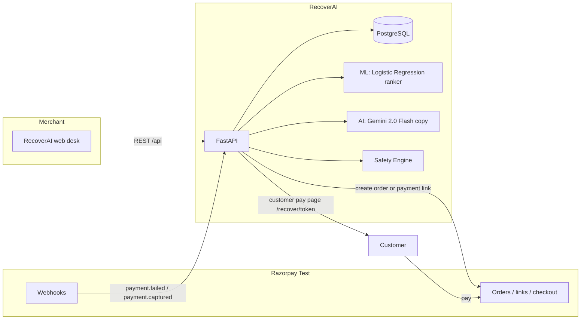
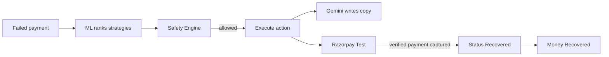
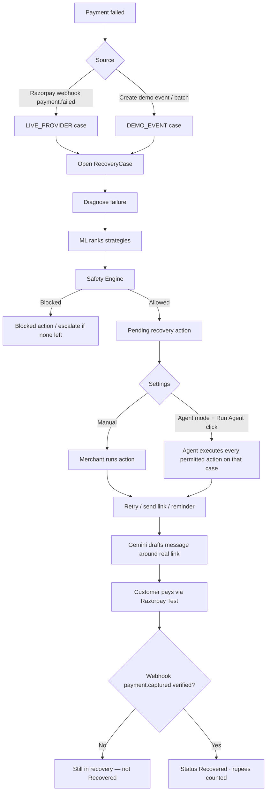
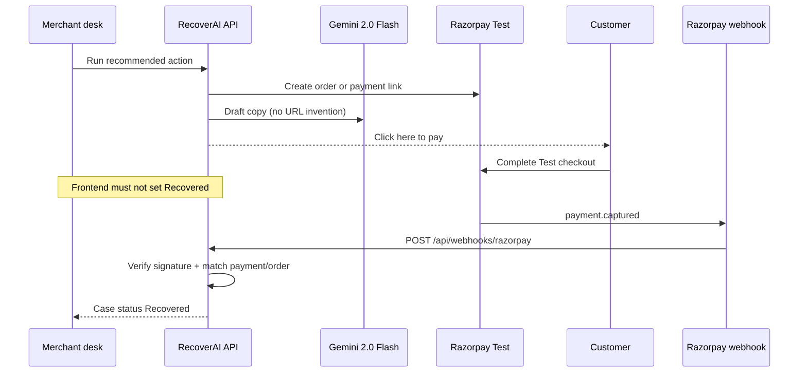

# RecoverAI

**AI-powered payment recovery for failed Razorpay payments.**

RecoverAI finds revenue sitting in failed charges, explains *why* they failed, recommends a safe recovery action, and counts rupees as recovered **only after Razorpay verifies a real capture**.

> Built for **Razorpay AI Buildathon — Track 03: AI Revenue Recovery**.  
> Scope: **payment failure → diagnosis → bounded recovery → verified money**.  
> Not in scope: checkout abandonment, subscriptions, voice recovery, or B2B invoice chasing.

---

## Table of contents

- [What does it solve?](#what-does-it-solve)
- [What we built](#what-we-built)
- [Tech stack](#tech-stack)
- [Machine learning](#machine-learning)
- [Training data](#training-data)
- [AI — Gemini LLM](#ai--gemini-llm)
- [Architecture](#architecture)
- [Recovery flow](#recovery-flow)
- [How recovery is confirmed](#how-recovery-is-confirmed)
- [Product surfaces](#product-surfaces)
- [Local development](#local-development)
- [Deploy notes](#deploy-notes)
- [Major error & how we solved it](#major-error--how-we-solved-it)
- [Build challenges & technical obstacles](#build-challenges--technical-obstacles)

---

## What does it solve?

Payment failure is not a single event. A card declines, a bank is down, a customer drops off — and the merchant often never gets that rupee back.

RecoverAI closes that loop:

| Step | What RecoverAI does |
| --- | --- |
| **Detect** | Ingests a failed payment (Razorpay `payment.failed` or a demo failure). |
| **Diagnose** | Classifies the failure and explains the root cause. |
| **Decide** | **ML** ranks recovery strategies; the Safety Engine allows or blocks them. |
| **Act** | Runs a bounded action: retry, payment link, reminder, alt method, or escalate. |
| **Communicate** | **Gemini** drafts customer copy around a real payment link (never invents URLs). |
| **Prove** | Marks **Recovered** only after a verified Razorpay `payment.captured` webhook. |

Merchants see amount at risk, in-recovery vs recovered vs escalated, a batch recovery demo, and an audit trail they can download.

**ML chooses which strategy looks most likely to recover. Gemini only writes the message. Safety Engine can still block the action. Money is counted only after Razorpay.**

---

## What we built

### Backend

- FastAPI recovery pipeline: ingest → case → diagnosis → strategy → safety → action → communication
- Razorpay **Test** integration: orders, payment links, webhook signature verification
- **Webhook authority**: the frontend never sets Recovered
- Merchant policy: **Manual** or **Run agent on every case** (per-case Run Agent button), with rupee caps
- Demo tools: create demo events, batch ingest, demo inventory, demo reset (demo rows only)
- Customer pay page token (`/recover/:token`) as a real pay-as-customer path

### Frontend

- Landing page → merchant desk (dashboard, cases, operations, analytics)
- Case view: next action, journey, progress, timeline, communications with **Click here** payment links
- Connect payments (Razorpay keys + webhook URL)
- Live activity feed, batch recovery demo, audit export (Excel CSV + PDF)

### Machine learning (separate from the LLM)

- scikit-learn **recovery-probability** pipeline trained on **synthetic** history (`recovery_training_data.csv`)
- Ranks strategies such as retry, payment link, reminder, alt method, escalate
- Probability is a **prediction**, not a recovered rupee

### AI / Gemini (separate from ML)

- **Google Gemini 2.0 Flash** drafts customer-facing copy only
- Does **not** pick strategies, invent payment URLs, or mark recovered

---

## Tech stack

### Application

| Layer | Choice | Why |
| --- | --- | --- |
| API | **Python · FastAPI · Uvicorn** | Typed recovery APIs, webhooks |
| ORM / DB | **SQLAlchemy · Alembic · PostgreSQL** | Cases, actions, audit logs, results |
| Payments | **Razorpay Python SDK** | Test orders, payment links, signed webhooks |
| UI | **React 19 · Vite · React Router** | Merchant desk + customer pay route |
| Styling | **Tailwind CSS · Lucide icons** | Operations UI |
| HTTP | **Axios** (frontend) · **httpx** (tests) | API client + TestClient |

### Machine learning

| Piece | What we used |
| --- | --- |
| Library | **scikit-learn · pandas · joblib** |
| Training data | **Synthetic** CSV: `backend/data/ml/recovery_training_data.csv` (**5,000** rows, `random.seed(42)`) |
| Generator | `backend/scripts/generate_ml_history.py` — **not** Razorpay live merchant history |
| Used in training? | **Yes** — `train_model.py` loads that CSV, trains three classifiers, saves the best |
| Artifact | `backend/models/recovery_predictor.joblib` |
| **Production model** | **Logistic Regression** (`max_iter=1000`, `random_state=42`) |
| Preprocessing | **OneHotEncoder** on `risk_tier`, `failure_category`, `strategy_type`; numeric features passed through |
| Candidates we trained & compared | Logistic Regression, **Random Forest** (300 trees), **Gradient Boosting** (150 trees) |
| Selection rule | Highest **ROC-AUC** on a stratified 80/20 split |
| Winner shipped | **Logistic Regression** (saved pipeline) |

### AI (LLM)

| Piece | What we used |
| --- | --- |
| Provider | **Google Gemini** via `google-genai` |
| **Model** | **`gemini-2.0-flash`** (override with env `GEMINI_MODEL`) |
| Job | Customer email / SMS / WhatsApp **copy** around a **real** payment URL |
| Not used for | Strategy ranking, Safety Engine, Razorpay calls, Recovered status |

### Hosting (typical)

| Piece | Where |
| --- | --- |
| Frontend | Vercel (`VITE_API_URL` = backend **origin**, no `/api` suffix) |
| Backend | Render (FastAPI) |
| Database | Render PostgreSQL (`postgresql://` + `sslmode=require`) |

---

## Machine learning

ML answers: *for this failed payment, how likely is strategy X to recover?*

```text
Case features
  amount_at_risk, payment_history_score, retry_count, contact_count
  risk_tier, failure_category, strategy_type
        │
        ▼
sklearn Pipeline  (OneHotEncoder + LogisticRegression)
        │
        ▼
P(recovered | strategy)   →  rank all strategies  →  Safety Engine
```

| We compared | Role |
| --- | --- |
| Logistic Regression | **Shipped** — best ROC-AUC in training; fast, inspectable |
| Random Forest | Candidate — 300 estimators, max depth 12 |
| Gradient Boosting | Candidate — 150 estimators, learning rate 0.05 |

Training script: `backend/scripts/train_model.py`. Inference: `backend/app/services/ai/recovery_predictor.py` → `strategy_ranker.py`.

**Hard split:** ML never writes customer messages and never marks **Recovered**.

---

## Training data

### Is it real Razorpay data?

**No.** `backend/data/ml/recovery_training_data.csv` is **synthetic** (generated in-repo). We did **not** train on production merchant payments or Razorpay settlement dumps.

We **did** use this file to train the shipped model: `train_model.py` reads it, fits Logistic Regression / Random Forest / Gradient Boosting, and writes `recovery_predictor.joblib`.

### How we created it

Script: `backend/scripts/generate_ml_history.py`

```text
generate_ml_history.py  (seed 42, 5,000 records)
        │
        ▼
data/ml/recovery_training_data.csv
        │
        ▼
train_model.py  (80% train / 20% test, stratified)
        │
        ▼
models/recovery_predictor.joblib   ← Logistic Regression pipeline
        │
        ▼
Live API ranks real cases  (features from RecoveryCase, not from the CSV)
```

Each row is a **simulated recovery attempt**: random amount, failure type, retries, contacts, and a strategy. A domain **probability formula** then flips a coin for `recovered` (0/1). That label is what the classifier learns.

| Column | Meaning |
| --- | --- |
| `amount_at_risk` | Simulated failed amount (integer, same scale as product amounts) |
| `payment_history_score` | Simulated 40–100 “how reliable is this payer” |
| `risk_tier` | `LOW` / `MEDIUM` / `HIGH` from that score |
| `failure_category` | e.g. `INSUFFICIENT_FUNDS`, `CARD_DECLINED`, `GATEWAY_TIMEOUT` |
| `retry_count` / `contact_count` | 0–3 simulated prior attempts |
| `strategy_type` | One of the nine recovery strategies the ranker uses in production |
| `recovered` | **Synthetic label** (1 if a random draw is below the domain probability) |
| `recovered_amount` | If recovered: 75–100% of amount; else 0 |

### Why synthetic (and what the formula encodes)

Hackathon / Test-mode product: we had **no historical RecoverAI outcomes** to train on. The generator encodes **plausible payment-recovery priors**, not leaked bank data:

- Base chance by failure type (e.g. gateway timeout easier than expired card)
- Higher payment-history score and low risk → more likely
- Larger amounts slightly harder
- More retries slightly harder; a little contact slightly helps
- Strategy bumps: e.g. alt method / payment link up; **STOP_RECOVERY** strongly down

Then: `recovered = 1` with that probability (`random.seed(42)` so the CSV is reproducible).

**Honest limit:** the model learns **this simulated world**. Live ranking still uses the same *feature names* from real cases; **Recovered rupees in the product still come only from Razorpay webhooks**, never from this CSV.

To regenerate:

```bash
cd backend
python scripts/generate_ml_history.py
python scripts/train_model.py
```

The CSV is gitignored (`backend/data/ml/*.csv`); regenerate locally if missing. The trained **`.joblib`** is what the API loads.

---

## AI — Gemini LLM

Gemini answers: *how should we word this message to the customer?*

| Item | Value |
| --- | --- |
| Model | **`gemini-2.0-flash`** |
| SDK | `google-genai` |
| Timeout | 20s (`GEMINI_TIMEOUT_SECONDS`) |
| Allowed channels | Email, SMS, WhatsApp (for communication strategies only) |

**Guardrails**

- ML ranks; Safety Engine approves; Gemini only drafts text
- Payment URL is injected from RecoverAI / Razorpay — Gemini must not invent `rzp.io` links
- If Gemini is down, templated copy still ships with the real link

---

## Architecture

### System context



### Decision vs copy vs money



### Request map

```text
Browser (Vite / Vercel)
        │
        │  GET/POST  https://<api-host>/api/...
        ▼
FastAPI
        ├── /api/events/payment          demo / simulated failure
        ├── /api/webhooks/razorpay       live provider events (signed)
        ├── /api/recovery/cases          cases, timeline, execute, run-agent
        ├── /api/dashboard/*             KPIs
        ├── /api/integrations/*          Razorpay credentials + policy
        └── /api/customer/recovery/:token  customer checkout config
        │
        ▼
PostgreSQL   (cases, payments, actions, communications, audit_logs, results)
```

---

## Recovery flow



**Hard rule:** Checkout success in the browser does **not** mark Recovered. Only a **signature-verified** `payment.captured` webhook does.

---

## How recovery is confirmed



---

## Product surfaces

| Area | Purpose |
| --- | --- |
| **Landing** | Public entry; opens the desk |
| **Dashboard** | KPIs, shortcuts, amount at risk |
| **Recovery Cases** | All cases |
| **Create demo event** | Simulated `payment.failed` for demos |
| **Live Activity** | Event feed from real case/timeline data |
| **Analytics** | Funnel, failure mix, recovery rate by category |
| **Operations** | In recovery / recovered / escalated / stopped |
| **Connect payments** | Razorpay Test keys + webhook URL |
| **Demo health** | Demo readiness + reset demo data only |
| **Settings** | Manual or per-case Run Agent + rupee caps |
| **Batch demo** | Many failures → measured recovery across the batch |
| **Customer pay** | `/recover/:token` — pay as the customer |

**Amounts** in the API are **paise** (₹1 = 100). The UI shows rupees.

**Stopped** = case status `CLOSED` (recovery ended without a verified capture). **Escalated** is different: no further automated action; it does not become Stopped by itself.

### Settings (how the desk runs)

The agent is explicitly triggered per recovery case during the demo, preventing uncontrolled batch execution and allowing every decision and action to be inspected independently.

```
Settings → select Agent mode → save policy
→ Run Agent appears on eligible cases
→ user triggers agent for one case
→ AI analysis → strategy selection → Safety Engine
→ permitted actions executed → verified payment result → audit trail
```

| Mode | What happens |
| --- | --- |
| **Manual** (default) | You click Execute. Timeline shows **Manual**. Saving policy does not run cases. |
| **Run agent on every case** | Saving only stores the mode. Each eligible case shows **Run Agent**. One click = one case, every Safety- and policy-allowed action. Timeline shows **Agent**. Stops for customer payment, over cap / high-value, Safety block, or escalation. |

Neither mode sets Recovered. Customer still pays; webhook still confirms.

---

## Local development

### Backend

```bash
cd backend
python -m venv .venv
# Windows: .\.venv\Scripts\Activate.ps1
pip install -r requirements.txt
uvicorn app.main:app --reload --host 127.0.0.1 --port 8000
```

### Frontend

Leave **`VITE_API_URL` unset** for local Vite. The app calls `/api`, and Vite proxies to `http://127.0.0.1:8000`.

```bash
cd frontend
npm install
npm run dev
```

Optional: `VITE_API_URL=http://127.0.0.1:8000` (origin only — **no** `/api`, **no** trailing slash).

### Razorpay Test webhook (local: zrok)

Razorpay cannot reach `127.0.0.1`. For **local** development, expose the FastAPI backend with **[zrok](https://zrok.io)** (`zrok share public` — the public HTTPS share used as the local webhook, sometimes called the **zrok2** URL), then paste that origin in the Razorpay Dashboard webhook.

1. Start the API on `127.0.0.1:8000` (see Backend above).
2. Share it with zrok:

```bash
zrok share public http://127.0.0.1:8000
```

3. Copy the public URL zrok prints (for example `https://<share>.share.zrok.io`).
4. In **Razorpay Dashboard → Webhooks**, set:

```text
POST https://<your-zrok-url>/api/webhooks/razorpay
Events: payment.failed, payment.captured
```

Use the **backend** zrok URL only — not the Vite/frontend URL, and not `/recover/<token>`.

Customer pay (browser) is still:

```text
http://localhost:<vite-port>/recover/<token>
```

or your deployed frontend. That is **not** the webhook URL. Opening `/api/webhooks/razorpay` in a browser is a GET; Razorpay must **POST**.

When you deploy, replace the zrok webhook with the public API (e.g. Render):

```text
POST https://<your-public-backend>/api/webhooks/razorpay
```

---

## Deploy notes

- **Frontend (Vercel):** SPA rewrite all paths to `index.html` so `/recover/:token` does not 404.
- **Backend CORS:** allow Vercel + localhost; do not set `CORS_ORIGINS` to the API URL itself.
- **Database URL:** use `postgresql://` (not `postgres://`); on Render use `sslmode=require`.
- **`PUBLIC_FRONTEND_URL`:** set to the Vercel origin so payment messages contain full `https://…` links.
- **`GEMINI_API_KEY`** + optional **`GEMINI_MODEL=gemini-2.0-flash`**.

---

## Major error & how we solved it

**The big one: treating Razorpay checkout “success” in the browser as Recovered.**

This is a revenue-recovery product. If Recovered is wrong, every KPI, batch demo, and judge pitch is wrong.

**What went wrong**

Razorpay Checkout runs in the customer’s browser. When Test pay succeeds, the `handler` callback fires immediately. It is tempting to `PATCH` the case to Recovered from that callback (or from the merchant UI after “payment succeeded”). That path is **not** RecoverAI’s source of truth:

- The browser can be closed, refreshed, or spoofed
- The callback is not a signed Razorpay event
- A green checkout is not the same as a captured payment on Razorpay’s servers

Doing that would **fake recovered rupees**.

**How we solved it**

Recovered is **webhook-only**.

1. Customer pays in Razorpay Test (checkout or payment link).
2. Razorpay sends `payment.captured` to `POST /api/webhooks/razorpay`.
3. RecoverAI **verifies the webhook signature**, matches the payment/order to the case, then sets **Recovered** and counts paise.
4. The frontend **never** sets Recovered. After checkout, the desk says wait and refresh until the webhook lands.

ML probability, Gemini copy, and merchant “run action” do not mark money recovered. Only a verified capture does.

---

## Build challenges & technical obstacles

Everything else we hit while shipping — still real, but not the core money-integrity bug above.

### 1. Demo events vs live Razorpay events

**Problem:** Test connection, demo ingest, and real `payment.failed` were easy to mix up. Demo reset must not delete live cases.

**Fix:** Tag source as `DEMO_EVENT` vs `LIVE_PROVIDER`. Demo reset deletes **demo rows only**. Razorpay Test connection does not create cases.

### 2. Payment links that never appeared

**Problem:** Communications showed *“A payment link could not be generated”* when Razorpay rejected the payload (customer fields, expiry, etc.).

**Fix:** Retry link create with a stripped payload. If Razorpay still fails, attach the real customer path `/recover/<token>`. UI renders **Click here**.

### 3. Gemini invented payment URLs

**Problem:** When link create failed, the LLM could output fake `rzp.io` links.

**Fix:** Gemini writes **surrounding copy only**. The URL is injected from Razorpay or `/recover/<token>`. No fabricated links.

### 4. Frontend talking to the wrong API

**Problem:** `VITE_API_URL` with `/api`, a trailing slash, or a placeholder broke production. Vite needs a proxy locally; Vercel needs the Render origin at **build** time.

**Fix:** Local = empty base URL + `/api` proxy. Production = backend **origin only**.

### 5. Customer pay page 404 on Vercel

**Problem:** `/recover/:token` is a client route. Vercel looked for a file and returned 404. Customers could not pay.

**Fix:** Rewrite all paths to `index.html` (`vercel.json` / `_redirects`).

### 6. Money and time bugs that looked like product bugs

**Problem:** Mixing rupees and paise inflated KPIs (often ~100×). Naive UTC timestamps showed the wrong clock.

**Fix:** Store and compute in **paise**; format INR in the UI. Parse naive timestamps as UTC and display **Asia/Kolkata**.

### 7. Agent vs high-value payments

**Problem:** Auto-run on large amounts is unsafe.

**Fix:** Settings default **Manual**. **Run agent on every case** only after you save that mode — then click **Run Agent** on a single case. The agent runs every Safety-allowed action under the agent cap (default **₹5,000**). High-value (default **₹10,000**) still needs you. The agent never marks Recovered.

### 8. CORS / Postgres on Render

**Problem:** Browser blocked the API; `postgres://` URLs failed; SSL required on Render.

**Fix:** CORS for Vercel and localhost. Normalize DB URL to `postgresql://` and `sslmode=require`.

### 9. Batch “measured money” without lying

**Problem:** The bar is recovered rupees across a batch, not a simulated green badge.

**Fix:** Batch demo creates real demo cases through the same orchestrator. Totals use verified recovery results, not frontend guesses.

### 10. Analytics looked like 100% recovery

**Problem:** Failure-mix chart used share of **failures** (e.g. 3/3 = 100%), which people read as recovery rate.

**Fix:** Chart labeled **% of failures**. Recovery rate is recovered / cases, shown separately.

### 11. Splitting ML from Gemini

**Problem:** “AI” looked like one chatbot that both decides and pays.

**Fix:** **Logistic Regression** ranks strategies; **Gemini 2.0 Flash** writes copy; Safety Engine gates actions; webhooks prove money.

---

## Invariants (do not break)

1. **Recovered** only from verified Razorpay `payment.captured`.
2. Amounts are **paise** in the API.
3. Gemini does not invent payment URLs and does not rank strategies.
4. ML probability is not a recovered rupee.
5. Safety Engine cannot be bypassed from the UI.
6. Demo reset does not delete live provider payments.

---

## License

Private / hackathon project — RecoverAI team.
